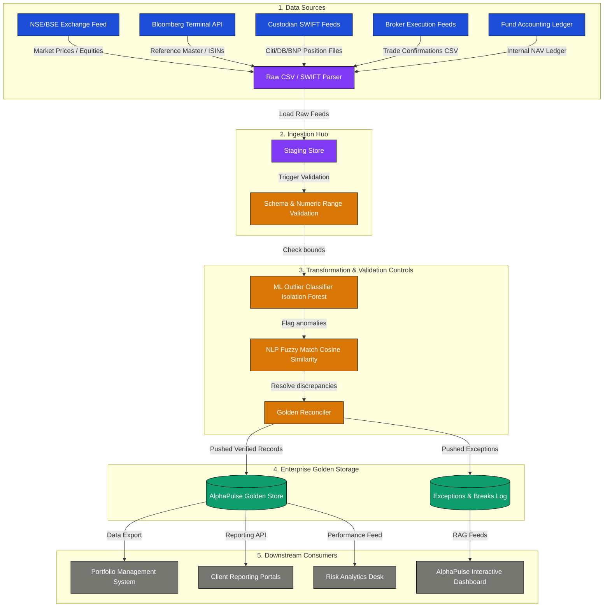

# AlphaPulse Enterprise Data Flow & Data Dictionary

This document establishes the official data governance catalog, metadata dictionary, and lineage architecture for the AlphaPulse Investment Data Management Platform. 

---

## 1. End-to-End Enterprise Data Lineage Flow

### 1.1 Step-by-Step Data Lineage Steps
1. **Sources (Ingestion Input)**: Real-time and batch files in CSV or SWIFT formats containing trade confirms, custodian holdings, client data, and market prices.
2. **Ingestion Hub**: Staging database parses incoming feeds, converts formats, and archives the raw data to ensure cold-storage backup.
3. **Transformation & DQ (Data Quality) Engine**:
   * *Transformation 1*: Standardizes date and currency fields to a uniform timezone (IST) and currency basis (INR).
   * *Transformation 2*: Merges records across identifiers (matching Ticker, ISIN, and Security Name).
   * *Transformation 3*: Computes active variables (Unrealised PnL, Break Percentages, Days Stale).
   * *Validation Controls*: Compares standard data quality flags (Completeness, Validity, Timeliness) and routes outliers via machine learning filters.
4. **Enterprise Storage (Golden Store)**: Stored in high-performance structured database schemas. Clean records enter the production "Golden Master", while invalid records/reconciliation breaks are dispatched to the Operations database for audit.
5. **Downstream Consumers**: Production systems consume the verified Golden Store for Portfolio Management, NAV valuations, Client Portal reporting, and regulatory audit compliance.

---

## 2. Enterprise Data Dictionary & Metadata Catalog

This catalog outlines the schemas, ownership, refresh cadence, and key controls for the eight core domains monitored on the AlphaPulse platform:

### 2.1 Client Data Master
* **Domain Owner**: Client Services Desk
* **Refresh Cadence**: Monthly (or upon client onboarding)
* **Downstream Consumers**: Client Portals, Portfolio Management, Compliance Desk
* **Metadata Fields**:

| Column Name | Data Type | Definition | Key Control / Constraint |
| :--- | :--- | :--- | :--- |
| `client_id` | String (Unique) | Unique identifier for the institutional client (e.g. `C-001`) | Primary Key, Regex: `^C-\d{3}$` |
| `client_name` | String | Official registered name of the corporate client | Cannot be Null or Empty |
| `client_type` | String | Type of institution (e.g. `Pension`, `Insurance`, `Sovereign`) | Enforced Enum values |
| `region` | String | Operational region (`APAC`, `EMEA`, `Americas`) | Region verification check |
| `aum_inr_crores` | Numeric | Total Assets Under Management in Crores INR | Must be > 0 |
| `kyc_status` | String | Status of Know-Your-Customer reviews | Flag for manual verification if `Expired` |

---

### 2.2 Securities Reference Master
* **Domain Owner**: Reference Data Team
* **Refresh Cadence**: Weekly (or on demand for new listings)
* **Downstream Consumers**: Golden Store, Trade Matching Engine, NAV Engine
* **Metadata Fields**:

| Column Name | Data Type | Definition | Key Control / Constraint |
| :--- | :--- | :--- | :--- |
| `security_id` | String (Unique) | Internal standard security identifier (e.g. `S-001`) | Primary Key |
| `ticker` | String | Asset exchange ticker code (e.g. `RELIANCE`, `TCS`) | Matches exchange active list |
| `isin` | String (12 chars) | International Securities Identification Number | Must be unique, 12 characters, regex validation |
| `asset_class` | String | Asset classification (`Equity`, `Fixed Income`, `Cash`) | Enforced Enum values |
| `sector` | String | Industry sector (`Tech`, `Energy`, `BFSI`, `Pharma`, etc.) | Enforced standard taxonomy |
| `status` | String | Listing operational state (`Active`, `Suspended`) | Validation alert if `Suspended` |

---

### 2.3 Positions Ledger
* **Domain Owner**: Fund Accounting Desk
* **Refresh Cadence**: End of Day (Daily)
* **Downstream Consumers**: PMS, Client Reporting, Risk Desk
* **Metadata Fields**:

| Column Name | Data Type | Definition | Key Control / Constraint |
| :--- | :--- | :--- | :--- |
| `position_id` | String (Unique) | Position line unique identifier | Primary Key |
| `client_id` | String | Client owner of the position | Foreign key to Client Data |
| `security_id` | String | Asset ID held in portfolio | Foreign key to Securities Master |
| `quantity` | Numeric | Ledger share holding volume | Must be positive |
| `market_price` | Numeric | Daily closing price | Cross-referenced against Share Prices |
| `market_value` | Numeric | Net holding valuation in INR (`quantity * market_price`) | Calculated column, cross-checked |
| `recon_status` | String | Current ledger status (`Matched`, `Unmatched`) | Trigger alert if `Unmatched` > 24 hours |

---

### 2.4 Trade Ledger
* **Domain Owner**: Trade Executions Desk
* **Refresh Cadence**: Real-time / Ingestion Batch
* **Downstream Consumers**: Positions Engine, Clearing, Portfolio Managers
* **Metadata Fields**:

| Column Name | Data Type | Definition | Key Control / Constraint |
| :--- | :--- | :--- | :--- |
| `trade_id` | String (Unique) | Unique broker execution ID | Primary Key |
| `client_id` | String | Institutional client execution ID | Foreign key to Client Data |
| `security_id` | String | Instrument identifier executed | Foreign key to Securities Master |
| `quantity` | Numeric | Trade execution shares volume | Must be > 0 |
| `trade_price` | Numeric | Trade execution execution price | Validation outlier bounds (3-sigma Z-score) |
| `broker` | String | Counterparty broker name | Verified authorized broker list |
| `exception_flag`| Boolean | True if trade fails schema validation | Automatic triage triggers if True |

---

### 2.5 Share Prices Master
* **Domain Owner**: Market Data Desk
* **Refresh Cadence**: Real-time / Intraday feeds
* **Downstream Consumers**: Positions valuation, NAV Engine, PMS
* **Metadata Fields**:

| Column Name | Data Type | Definition | Key Control / Constraint |
| :--- | :--- | :--- | :--- |
| `security_id` | String | Instrument identifier priced | Foreign key reference |
| `close_price` | Numeric | Daily standard closing price | Zero or negative pricing check |
| `is_stale` | Boolean | True if price hasn't updated in the current cycle | Alert if stale for > 1 business day |
| `days_stale` | Numeric | Number of business days price remains un-refreshed | Isolation Forest outlier features |

---

### 2.6 Performance Ledger
* **Domain Owner**: Portfolio Analytics Desk
* **Refresh Cadence**: Daily (Post-NAV run)
* **Downstream Consumers**: PMs, Client Portals, Risk Desk
* **Metadata Fields**:

| Column Name | Data Type | Definition | Key Control / Constraint |
| :--- | :--- | :--- | :--- |
| `client_id` | String | Institutional client owner ID | Foreign key reference |
| `ytd_return_pct`| Numeric | Year-to-Date return calculated using Time-Weighted Return (TWR) | Standard performance range bounds |
| `benchmark_name`| String | Assigned performance comparison index (e.g. `Nifty 50`) | Linked in client contract terms |
| `sharpe_ratio` | Numeric | Risk-adjusted return metric (12-month trailing) | Must be positive in standard conditions |

---

### 2.7 Reconciliation Breaks Log
* **Domain Owner**: Reconciliation Operations Team
* **Refresh Cadence**: Real-time
* **Downstream Consumers**: Operations Dashboard, Escalation Lead, Custodians
* **Metadata Fields**:

| Column Name | Data Type | Definition | Key Control / Constraint |
| :--- | :--- | :--- | :--- |
| `security_name` | String | Name of the asset exhibiting a quantity break | Checked via NLP TF-IDF fuzzy similarity |
| `source_quantity`| Numeric | Volume reported in external Custodian settlement feed | Reconciled volume reference |
| `internal_quantity`| Numeric | Volume reported in internal Ledger Golden Store | Reconciled ledger reference |
| `break_value_inr`| Numeric | Financial variance in INR (`|source - internal| * price`) | RAG rating thresholds based on value |
| `break_pct` | Numeric | Percentage of variance relative to source quantity | RAG status triggers if break_pct > 1% |

---

### 2.8 Exceptions Log
* **Domain Owner**: Data Quality & Governance Desk
* **Refresh Cadence**: Real-time
* **Downstream Consumers**: Data Ops Queue, Exceptions Dashboard, Systems Support
* **Metadata Fields**:

| Column Name | Data Type | Definition | Key Control / Constraint |
| :--- | :--- | :--- | :--- |
| `exception_id` | String (Unique) | System-generated tracking ID | Primary Key |
| `dataset` | String | Source dataset experiencing failure | Linked to standard 6 dataset masters |
| `exception_type`| String | Specific category (e.g. `Missing Price`, `Schema Mismatch`) | Exception routing logic reference |
| `severity` | String | Priority rating (`High`, `Medium`, `Low`) | Dictates SLA resolution speed |
| `status` | String | Tracking state (`Open`, `In Progress`, `Resolved`, `Escalated`) | Tracks active SLA timer |
| `sla_deadline` | Timestamp | Standard operational resolution deadline | Triggers breach flag if current time > deadline |

---

## 3. Operations & Feed Onboarding Playbook

### 3.1 Client / Portfolio Onboarding Checklist
1. **RACI Assignment**: Assign client representative to Client Services (A) and Operations Analyst (R).
2. **KYC Verification**: Confirm `kyc_status` is `Completed`. Load details to `Client Data Master` with validated region details.
3. **System Mapping**: Link client accounts with respective external Custodians (Citi, DB, BNP, JP) and downstream PMS channels.
4. **Tolerance Controls Configuration**:
   * Standard volume breaks threshold: 0.1%.
   * Financial variance breach alarm threshold: ₹500,000 INR.

### 3.2 Data Feed / File Intake Standards
* **Supported Protocols**: Secure SFTP / HTTPS API / SWIFT Messaging Hub.
* **File Format Specifications**: UTF-8 encoded, standard CSV (header required, comma-delimited).
* **Mandatory Reference Keys**:
  * Every transaction must supply a registered `isin` or a matching `ticker`.
  * Quantities and Prices must occupy positive decimal formats. Null values trigger automatic trade isolation alerts.
